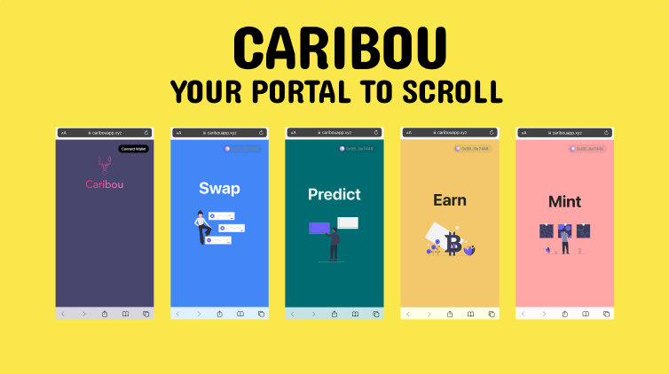

# Caribou

Caribou is your mobile-first, social login portal to the Scroll ecosystem. Caribou allows users to log in using familiar Web2 authentication methods, avoiding often intimidating blockers for new users like private keys, self custodial wallets, and adding networks, while encouraging use through a familiar Web2 "swipe & flip" based interface and a range of different apps and digital assets available directly from the app.

## Features:
- Token & Portfolio Tracking
- Swap & Trending Tokens
- Prediction Markets
- Earn Markets (DeFi)
- Mint NFTs & Digital Collectibles
- Rewards

